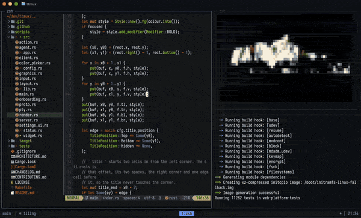

<h1 align="center">ttmux</h1>

<p align="center"><em>A modern multiplexer alternative.</em></p>

<p align="center">
  <a href="https://github.com/statico/ttmux/actions/workflows/ci.yml"></a>
  <a href="https://github.com/statico/ttmux/releases"></a>
  <a href="LICENSE"></a>
  
  
</p>

<p align="center"></p>

> [!WARNING]
> **Beta software.** ttmux is still under test. Expect bugs, and expect the
> config format to change before 1.0.

> [!NOTE]
> **Made entirely with [Claude Code](https://claude.com/claude-code).** Every
> line of this project was written by Claude.

ttmux runs many terminals in one window, like tmux or screen. It adds
floating panes, real mouse support, curved borders, and a settings screen
that you open inside the app.

## Install

With Homebrew, on macOS or Linux:

```
brew install statico/tap/ttmux
```

Or build it from source, which needs Rust 1.82 or later:

```
cargo install --git https://github.com/statico/ttmux
```

Then start it:

```
ttmux
```

Prebuilt binaries for macOS and Linux are also on the
[releases page](https://github.com/statico/ttmux/releases).

## Why

tmux works well and has decades of muscle memory behind it. But a fresh tmux
needs a `.tmux.conf` and plugins like
[tmux-sensible](https://github.com/tmux-plugins/tmux-sensible) before it
stops getting in the way. ttmux ships with those defaults.

| | tmux, out of the box | ttmux |
|---|---|---|
| Escape key | a delay after <kbd>esc</kbd> (500ms before 3.5) | no delay, so vim leaves insert mode at once |
| Scrollback | 2,000 lines | 10,000 lines |
| Mouse | off | on: click, drag, resize, and wheel |
| Color | truecolor and undercurl need `terminal-overrides` | truecolor and undercurl |
| Focus events | off | on |
| Clipboard | ignores OSC 52 from programs | copies to your clipboard, or set `clipboard = false` |
| Modern keys | `extended-keys` off, so shift+enter is lost | kitty keyboard and modifyOtherKeys |
| Images | sixel if built in, the rest need `allow-passthrough` | kitty, iTerm2, and sixel, even `mpv` video, and nothing but images |
| Config | `.tmux.conf`, `source-file` by hand | TOML, reload with the prefix and <kbd>r</kbd>, or a settings screen |
| Discovering keys | a list behind the prefix and `?` | a which-key popup and a command palette |
| Layout | tiling | tiling or free-floating, drag and drop |
| Agents | — | a per-pane busy, needs-you, or done mark |

## Keys

On first start ttmux asks which keymap you want: Modern, tmux, or screen.
Change it later in settings or with `general.keys-preset`, and rebind any
key under `[keys]`.

<details>
<summary>Keys for each keymap</summary>

| Action | Modern (`ctrl+t`) | tmux (`ctrl+b`) | screen (`ctrl+a`) |
|---|---|---|---|
| Split right | `v` or `%` | `%` | `\|` |
| Split down | `s` | `"` | `S` |
| Move the focus | `h` `j` `k` `l` | arrows | `tab` |
| Resize the pane | `H` `J` `K` `L` | | |
| Zoom the pane | `z` or `o` | `z` | |
| Float one pane | `f` | | |
| Next layout | `space` | `space` | |
| New, next, previous tab | `c` `n` `p` | `c` `n` `p` | `c` `n` `p` |
| Last tab | `ctrl+t` | | |
| Move the tab left or right | `<` `>` | | |
| Break the pane into a tab | `!` | `!` | |
| Join the pane into a tab | `@` | | |
| Rename the tab, the pane | `A`, `a` | `,`, `.` | `A`, `.` |
| Scroll back, or copy mode | `[` or `esc` | `[` | `esc` |
| Paste what copy mode copied | `]` | `]` | `]` |
| Close the pane | `x` or `q` | `x` | `K` |
| Close the tab | `&` | `&` | |
| Command line | `:` | `:` | `:` |
| Command palette | `;` | | |
| Send the prefix | `t` | `ctrl+b` | `a` |
| Settings | `,` | | |
| Help | `?` | `?` | `?` |
| Detach | `d` | `d` | `d` |
| Quit ttmux | `Q` | | |

Every keymap also has these, with no prefix:

| Key | Action |
|---|---|
| <kbd>alt+arrows</kbd> | Move the focus |
| <kbd>alt+shift+arrows</kbd> | Resize the pane |
| <kbd>ctrl+alt+right</kbd> / <kbd>down</kbd> | Split right or down |
| <kbd>ctrl+alt+w</kbd> | Close the pane |
| <kbd>ctrl+alt+f</kbd> | Switch between tiling and free mode |
| <kbd>ctrl+alt+z</kbd> | Zoom the pane |
| <kbd>ctrl+alt+t</kbd> | New tab |
| <kbd>ctrl+alt+p</kbd> | Command palette |
| <kbd>ctrl+alt+,</kbd> | Settings |
| <kbd>ctrl+alt+n</kbd> | Go to the next pane that wants you |
| <kbd>shift+pageup</kbd> / <kbd>pagedown</kbd> | Scroll back and forward |

</details>

Press the prefix and <kbd>?</kbd> in the app for the full list.

tmux's copy mode is off by default, because programs like coding agents
copy on their own and want the mouse drag. Set `general.copy-mode = true`
and the scroll back key opens it: move with <kbd>h</kbd> <kbd>j</kbd>
<kbd>k</kbd> <kbd>l</kbd>, press <kbd>v</kbd> to start a selection and
<kbd>y</kbd> to copy it, or <kbd>q</kbd> to leave. A mouse drag over a pane
also copies. The copy goes to your clipboard and to a paste buffer that the
prefix and <kbd>]</kbd> types back.

Hold the prefix and a popup lists what can follow it, like which-key in
neovim. Turn it off with `general.which-key = false`.

The prefix and <kbd>:</kbd> open a command line for the scripting
commands below. <kbd>Tab</kbd> completes a command or a flag, and the row
above shows the usage of the command you are typing.

A name you type is yours. A program can set a title with an escape
sequence, but that title never replaces a name you set, and it names the
pane, not the tab. The tab takes the title only while it holds one pane.

Every text field takes the readline keys, including <kbd>ctrl+a</kbd>,
<kbd>ctrl+e</kbd>, <kbd>ctrl+w</kbd>, <kbd>ctrl+k</kbd>, <kbd>ctrl+u</kbd>,
<kbd>ctrl+y</kbd>, <kbd>alt+b</kbd>, and <kbd>alt+f</kbd>. Lists move with
<kbd>ctrl+n</kbd> and <kbd>ctrl+p</kbd>, and <kbd>ctrl+g</kbd> cancels.

## Free mode

<kbd>ctrl+alt+f</kbd> turns the grid of panes into a window manager. Drag a
title bar to move a pane. Drag any corner to resize it. Click to raise it.
Tiling mode gets the same mouse support for dividers. Grab the line between
two panes and drag it.

## Sessions

ttmux works like tmux. The server keeps your panes alive after you detach.

```
ttmux                       # attach to the default session, or start it
ttmux new -d -s work        # start a session in the background
ttmux attach -t work        # attach to a named session
ttmux ls                    # list the sessions
ttmux kill-session -t work  # stop one
ttmux upgrade               # move a session to a server started from here
```

<kbd>ctrl+t</kbd> <kbd>d</kbd> detaches.

`ttmux upgrade` moves a live session to a new server. The shells, jobs, and
screens stay. Add `-t work` for a named session. Use it for two things:

- **A new version.** Install the new build, then run `ttmux upgrade`. The
  session then runs on the new build.
- **The macOS keychain and permission prompts.** macOS ties them to the
  terminal that started the server. When that terminal quits, panes cannot
  unlock the keychain or show a permission prompt. Run `ttmux upgrade` in a
  live terminal to correct this. `ttmux doctor` tells you if a session has
  this problem.

The scrollback comes back as plain text, and inline images are lost.

When a client attaches, new panes get its `SSH_AUTH_SOCK`, `DISPLAY`, and the
other variables in `general.update-environment`.

## Scripting

Every pane can drive the session it lives in. The commands are tmux's, so a
tmux script mostly runs unchanged.

<details>
<summary>The commands</summary>

```
ttmux send-keys -t %2 "make test" Enter   # type into a pane
ttmux split-window -h                     # split side by side, prints %2
ttmux capture-pane -t %2 -S -             # read a pane, scrollback and all
ttmux new-window                          # open a tab, prints its number
ttmux select-pane -t %2                   # or -L -R -U -D
ttmux list-panes                          # %2: [80x24] zsh (active)
ttmux list-windows                        # 1:build (2 panes) (active)
ttmux rename-window build                 # name a window
ttmux display-message "done"              # show text in the status bar
ttmux join-pane -s %3 -t 2                # move a pane into window 2
ttmux break-pane                          # and back out into its own
ttmux run toggle-zoom                     # any key-binding action
```

</details>

A target is a pane id from `list-panes`, or a window number counted from 1.
With no target the command acts on the pane it was run from, or the focused
pane outside ttmux. The session is the one `$TTMUX_SESSION` names, which
every pane already has set. `ttmux --help` prints the full list.

[API.md](API.md) is the full reference: every command, every flag, the exit
codes, and recipes. `ttmux <command> --help` prints one command, and
`ttmux list-commands --json` prints the whole API for an agent to read.

## Config

The file is `~/.config/ttmux/ttmux.toml`. ttmux writes it for you on the
first save. Every key in it is also in the settings screen, so the file is
for version control and the screen is for changes.

After you edit the file, press the prefix and <kbd>r</kbd> to reload it.
ttmux does not reload it on its own, because widget commands in it run as
you, and a program that writes the file should not get them run unasked.

<details>
<summary>An example config</summary>

```toml
[general]
mouse = true
scrollback = 10000
free-mode = false
keys-preset = "vim"          # vim | tmux | screen
passthrough-images = true    # kitty, iTerm2, and sixel inline images
clipboard = true             # programs may copy with OSC 52
notifications = true         # programs may send OSC 9, 99, and 777
copy-mode = false            # tmux's copy mode and mouse-drag copy
update-environment = ["SSH_AUTH_SOCK", "DISPLAY"]  # taken from each client that attaches

[appearance]
border-style = "curved"      # curved | square | heavy | double | dashed | divider | none
border-focused = "#7aa2f7"
gap = 0

[status.footer]
enabled = true
left = ["session", "mode"]
center = ["tabs"]
right = ["agents", "time"]

[agents]
enabled = true
bell-on-attention = true

# Overrides on top of the preset. "none" unbinds a key.
[keys]
"ctrl+t v" = "split right"
"ctrl+t &" = "none"
```

</details>

## Custom widgets

A widget runs a shell command and shows what it prints. Give it a name under
`[status.widgets]`, then put that name in a row.

<details>
<summary>How widgets work</summary>

```toml
[status.footer]
enabled = true
right = ["disk", "time"]

[status.widgets.disk]
command = "df -h / | awk 'NR==2 {print $5}'"
interval = 60               # seconds between runs, 0 runs it once
```

The command runs with `sh -c`, so pipes, globs and `~` work. ttmux uses the
first line of the output. tmux markup such as `#[fg=red,bold]` is honored, so
a script written for tmux `status-right` works without a change.

A slow command does not block the screen. It runs in its own thread, and ttmux
does not start a second copy while the first one runs.

</details>

## Coding-agent alerts

A pane that runs a coding agent gets a mark: `◐` for busy, `●` for wants
you, and `✓` for done. The status bar counts the panes that wait on you, and
<kbd>ctrl+alt+n</kbd> goes to the next one. The patterns live under
`[agents]`, so this works with any agent.

## Terminals

ttmux is built against Ghostty and iTerm2. Any terminal with 24-bit color
and SGR mouse reporting works, including Alacritty, kitty, WezTerm, and
Terminal.app.

<details>
<summary>Ghostty and alt+arrows</summary>

Ghostty never sends `alt+left` and `alt+right` to ttmux, because it binds
them to the word motions of readline. To get horizontal focus movement back,
unbind them in the config of Ghostty:

```
keybind = alt+left=unbind
keybind = alt+right=unbind
```

</details>

## Compatibility

What programs inside a pane can count on:

- Truecolor, and undercurl, dotted, dashed and double underlines in color
- Emoji with skin tones, flags and ZWJ sequences as one wide cell
- Kitty keyboard protocol and modifyOtherKeys, so shift+enter works
- Kitty, iTerm2 and sixel images, including `mpv --vo=kitty` video
- Synchronized output, so redraws do not tear
- Focus events, and a cursor shape per pane
- OSC 52 copy to your clipboard, and OSC 9, 99 and 777 notifications, each
  of which can be turned off
- Answers to cursor position, device attributes, window size, mode, color
  and XTGETTCAP queries, so fzf, neovim and fish do not stall
- Dark or light theme reports (`CSI ?996n`, mode 2031)
- Scrollback that keeps output scrolled under a fixed footer, as Claude
  Code and Codex draw, and `CSI 3J` to clear it
- Pastes that cannot close their own bracket early
- No accidental nesting: attaching from inside a pane is refused, as in tmux

## Platforms

macOS on Apple silicon and Intel, and Linux on x86_64 and aarch64. CI builds
and tests all three.

## Security

[SECURITY.md](SECURITY.md) describes the threat model, the hardening, how
ttmux compares with tmux, and how to report a vulnerability.

## Development

```
make check      # format, lint, and test, the same as CI
make help       # all the targets
```

MIT licensed.
